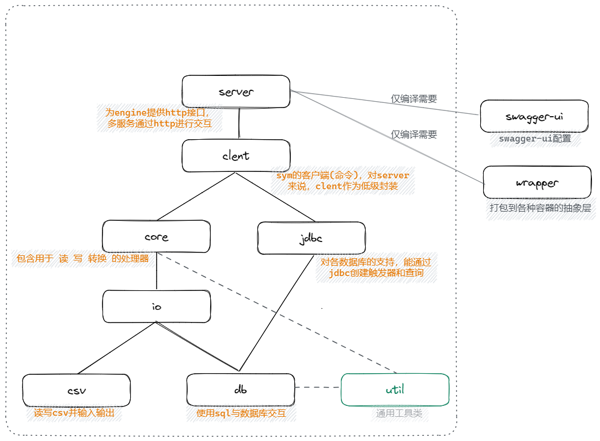

## dbsyncerlib
* 基于symmetric-ds框架3.13.10版本  
* symmetric-ds是一个国外开源的数据库同步（重心）与文件同步的框架，详见[官网](https://www.symmetricds.org/)，如果使用sym框架，务必仔细阅读官方文档  
* 本项目对symmetric-ds提供一些扩展，集成在自己的项目中，使得自己的项目支持数据库同步（就是要集成入一个项目再使用，因为symmetric-ds开源版是不包含界面的）

## 目录说明
dbsyncerlib是个单纯的文件夹，symmetric-assemble是项目入口
```text
dbsyncerlib             -- 单纯的文件夹 
 ├── symmetric-assemble -- 项目入口，用于构建。使用idea打开此文件夹 
 ├── symmetric-client   -- 低级客户端(命令)，可视为server模块的低级封装
 ├── symmetric-core     -- 核心 
 ├── symmetric-csv      -- 读写csv进行输入输出 
 ├── symmetric-db       -- 使用sql操作数据库 
 ├── symmetric-io       -- 读写与数据转换的处理 
 ├── symmetric-jdbc     -- 对数据库进行操作的功能扩展 
 ├── symmetric-server   -- 以服务方式启动，提供http接口管理节点与任务 
 ├── symmetric-util     -- 通用工具 
 └── symmetric-wrapper  -- 打包到各个容器的抽象层 
```
模块依赖如图：swagger-ui已合并入server


## 初始化
> gradle解析并加载模块
```shell
gradlew develop
```

## 集成
### 依赖
* 本项目源码放到源项目中
* 本项目执行以下命令（assemble中），生成jar包。原项目直接对这些jar包进行依赖

```shell
gradlew jar
```

### 原项目做些什么
* 提供服务配置文件
* 页面的参数足够生成数据库节点的配置文件，sym会根据这个配置文件创建节点对象。symmetric-ds比较灵活，生成什么样的配置文件（节点间如何同步），取决于业务需要
* symmetric-ds本身复杂度比较高，可以扩展些代码提高系统健壮性，比如检查，强制保持一致性等

## Symmetric-ds 简述
symmetric-ds将文件同步的流程与数据库同步的流程设计为一样的。
数据库同步： 
* 使用jdbc，一般利用数据库的触发器来实现。
  * 但并不总是这样，因为symmetric-ds支持的数据库种类中，有不支持触发器的。
* 普通sym服务向主服务注册，所有信息存储在主服务的数据库中。主服务的数据库有两种选则：
  * 将同步节点数据库作为主服务的库，将sym服务的所有相关信息存储在同步节点上
  * （推荐）主服务拥有自己的数据库，但要注意，每组任务的信息要独立存储，用h2或sqlite比较合适。若数据库为load only,则只能使用这种架构支持

文件同步：
* 自然只能选取主服务自带库的方式啦
* 在同步目录的根下生成agent